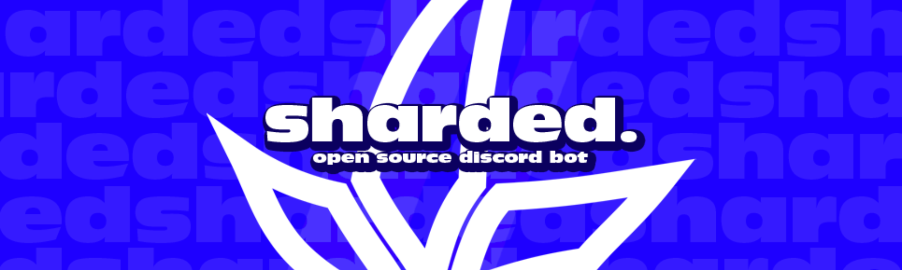

# Sharded

>[!WARNING]
>All **sharded products and services** are under major development and may be unstable at times.

**Sharded** is a python-powered discord bot which brings power to the users. It's designed to be **powerful yet simple,** get started today at [sharded.app](https://sharded.app) with **our servers** or **self-host with your own servers** and be able to customize everything.

> *"Powerful discord bots shouldn't be locked behind massive paywalls or closed source."* - Adam, Lead Maintainer.

## Installing sharded
>[!WARNING]
>Installation methods are set to change in the near future. Currently we only support self-hosting but we have plans to introduce sharded cloud.

Sharded is a docker project hosted on GitHub Packages with `latest` being currently its only tag. **Keep in mind every push is being updated to the `latest` tag.**

You can pull the image by running,

```bash
docker pull ghcr.io/shardedinteractive/sharded:latest
```
